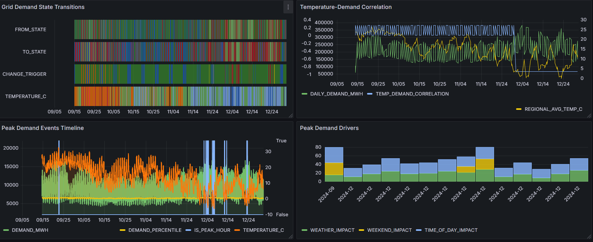

# weather-volt

WeatherVolt is a comprehensive data engineering solution designed to analyze electricity demand patterns, weather correlations, and grid performance. The platform integrates electricity data with weather observations to provide deep insights into energy consumption behaviors and enable data-driven decision making. Currently, the platform focuses on North Carolina, with the technical architecture designed to accommodate expansion to additional regions as needed.

## Key Features
- **End-to-end ELT Pipeline:** Containerized data extraction, loading, and transformation workflow that processes both electricity demand and weather observation data
- **Multi-stage Data Processing:** Structured data handling through raw, staging, and analytics layers with proper validations at each stage
- **Advanced Data Modeling:** Implementation of specialized modeling techniques including cumulative tables, state tracking, and bridge tables
- **Weather-Electricity Correlation:** Statistical analysis correlating temperature fluctuations with electricity demand patterns
- **Peak Demand Analysis:** Identification and classification of peak demand events with driver attribution
- **Grid State Monitoring:** Tracking transitions between demand states (LOW, NORMAL, HIGH, PEAK) with trigger identification
- **Generation Mix Analysis:** Visibility into the composition of energy sources in the electricity generation mix
- **Interactive Dashboards:** Visualizations of key metrics and patterns through Grafana

## Data Sources
### Electricity Demand Data:
   Data is fetched from the EIA API v2 endpoint (https://www.eia.gov/opendata/) using authorized API keys. 

  #### Hourly Electricity Demand Data:
  - Description: Time-series data of hourly electricity consumption
  - Coverage: North Carolina balancing authorities (CPLE, DUK)
  - Key metrics: Hourly demand in megawatt-hours (MWh)
  - Frequency: Hourly updates
  - Format: JSON
  #### Electricity Generation Mix
  - Description: Breakdown of electricity production by energy source
  - Key metrics: Generation by fuel type (natural gas, coal, nuclear, renewables)
  - Parameters: Monthly frequency, generation data, location-based filtering
  - Frequency: Monthly updates
  - Format: JSON
  #### Retail Sales Data
  - Description: Consumer electricity sales information
  - Key metrics: Sales volume (MWh), revenue, price, customer counts
  - Parameters: Monthly frequency with NC state filtering
  - Frequency: Monthly updates
  - Format: JSON

### Weather Data - National Oceanic and Atmospheric Administration (NOAA)
NOAA provides comprehensive weather data through its Integrated Surface Database (ISD).

### Weather Observations (FTP transfer from NOAA's public server (ftp.ncei.noaa.gov))
- Description: Ground station weather measurements
- Coverage: Five weather stations across North Carolina:
  - Raleigh-Durham International Airport (723060-13722)
  - Charlotte Douglas International Airport (723140-13881)
  - Greensboro Piedmont Triad International Airport (723170-13723)
  - Asheville Regional Airport (723150-03812)
  - Wilmington International Airport (723020-13748)
- Key metrics: Temperature (°C), pressure (hPa), dew point (°C), wind speed (m/s)
- Frequency: Hourly observations
- Format: Fixed-width text files (parsed into structured JSON)

## Data Ingestion and Integration

