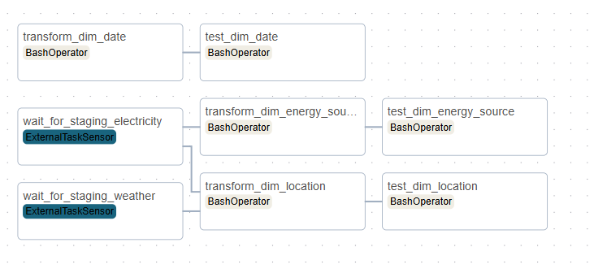

# weather-volt


WeatherVolt is a comprehensive data engineering solution designed to analyze electricity demand patterns, weather correlations, and grid performance. The platform integrates electricity data with weather observations to provide deep insights into energy consumption behaviors and enable data-driven decision making. Currently, the platform focuses on North Carolina, with the technical architecture designed to accommodate expansion to additional regions as needed.

## Table of Contents
1. [Key Features](#key-features)
2. [Data Sources](#data-sources)
3. [Data Ingestion and Integration](#data-ingestion-and-integration)
4. [Infrastructure Setup](#infrastructure-setup)
5. [Data Orchestration](#data-orchestration)
6. [Data Pipeline](#data-pipeline)
7. [Data Modeling](#data-modeling)
8. [Visualization](#visualization)

## Key Features
- **End-to-end ELT Pipeline:** Containerized data extraction, loading, and transformation workflow that processes both electricity demand and weather observation data
- **Multi-stage Data Processing:** Structured data handling through raw, staging, and analytics layers with proper validations at each stage
- **Advanced Data Modeling:** Implementation of specialized modeling techniques including cumulative tables, state tracking, and bridge tables
- **Weather-Electricity Correlation:** Statistical analysis correlating temperature fluctuations with electricity demand patterns
- **Peak Demand Analysis:** Identification and classification of peak demand events with driver attribution
- **Grid State Monitoring:** Tracking transitions between demand states (LOW, NORMAL, HIGH, PEAK) with trigger identification
- **Generation Mix Analysis:** Visibility into the composition of energy sources in the electricity generation mix
- **Interactive Dashboards:** Visualizations of key metrics and patterns through Grafana

## Data Sources
### Electricity Demand Data:
   Data is fetched from the EIA API v2 endpoint (https://www.eia.gov/opendata/) using authorized API keys. 

  #### Hourly Electricity Demand Data:
  - Description: Time-series data of hourly electricity consumption
  - Coverage: North Carolina balancing authorities (CPLE, DUK)
  - Key metrics: Hourly demand in megawatt-hours (MWh)
  - Frequency: Hourly updates
  - Format: JSON
  #### Electricity Generation Mix
  - Description: Breakdown of electricity production by energy source
  - Key metrics: Generation by fuel type (natural gas, coal, nuclear, renewables)
  - Parameters: Monthly frequency, generation data, location-based filtering
  - Frequency: Monthly updates
  - Format: JSON
  #### Retail Sales Data
  - Description: Consumer electricity sales information
  - Key metrics: Sales volume (MWh), revenue, price, customer counts
  - Parameters: Monthly frequency with NC state filtering
  - Frequency: Monthly updates
  - Format: JSON

### Weather Data - National Oceanic and Atmospheric Administration (NOAA)
NOAA provides comprehensive weather data through its Integrated Surface Database (ISD).

### Weather Observations (FTP transfer from NOAA's public server (ftp.ncei.noaa.gov))
- Description: Ground station weather measurements
- Coverage: Five weather stations across North Carolina:
  - Raleigh-Durham International Airport (723060-13722)
  - Charlotte Douglas International Airport (723140-13881)
  - Greensboro Piedmont Triad International Airport (723170-13723)
  - Asheville Regional Airport (723150-03812)
  - Wilmington International Airport (723020-13748)
- Key metrics: Temperature (°C), pressure (hPa), dew point (°C), wind speed (m/s)
- Frequency: Hourly observations
- Format: Fixed-width text files (parsed into structured JSON)

## Data Ingestion and Integration
To integrate different data sources, steps were taken to be able to perform cohesive analysis. 
### Aligning Temporal Data
All datasets do not follow the same update frequency, resulting in some data being collected monthly, while some hourly. To address this:
- Hourly weather observations are aligned with hourly electricity demand data using timestamp-based joins
- Monthly generation and retail data are aggregated and summarized from hourly demand data to enable period-over-period analysis
  
### Geographic Mapping
Although done later stage, particularly when creating dimension models, I feel this mapping should be explained here to explain the discrepancies in data. To create mapping between the locations from weather data and electricity data, a custom table is being used to map balancing authorities to nearest relevant weather station. This mapping is crucial for correlation analyis.

### Incremental downloads 
- The raw tables in Snowflake are queried for the latest timestamp it has
- Only data after this timestamp is queried for by adjusting the start parameter accordingly for each API basded on their frequency 


## Infrastructure Setup
Docker containerization has been used to create a reproducible and portable environment. The following interconnected containers are used:  
- airflow-webserver: Airflow UI and web service
- airflow-scheduler: Orchestrates task execution
- airflow-worker: Executes data pipeline tasks
- postgres: Metadata database for Airflow
- dbt: Runs transformation logic
- grafana: Visualization and dashboarding

Environment specific settings are managed through a combination of .env files to store credentials, airflow variables and docker environment variables.

Docker volume is used to persist data and Docker network is used for container-to-container communication.

## Data Orchestration
Orchestration is done by Apache Airflow. The key dags:
1. Raw data extraction:
   
<div align="center">
  
  
</div>

2. Staging tables:

<div align="center">
  
  
</div>

3. Dimension and Fact Tables:
<div align="center">
  
  
</div>

4. Analytics table:
<div align="center">
  
</div>

## Data Pipeline

A Extract Load Tranform (ELT) architecture is used, leveraging Snowflake's compute for transformations. This helps preserve the raw data, allows for complex transforms and supports reprocessing if business logic changes.

The pipeline maintains separate layers:
1. Extraction layer: Data is retrived from source
2. Raw layer: Unmodified data is stored in Snowlake and file storage
3. Staging layer: Tables are cleaned with basic transformations
4. Analytics layer: Business ready models with metrics and dimensions.

<div align="center">
  
</div>

### dbt Implementation
Data Build Tool (dbt) is used to manage transformations with several key features:
- Materialization Strategies: Tables vs views based on access patterns
- Testing Framework: Column nullability, uniqueness, and referential integrity on tables
- Documentation: Auto-generated catalog of tables and columns
- Packages: Using dbt_utils for surrogate key generation and other utilities

## Data Modeling 
### Backfilling support
1. Surrogate keys are generated using the dbt_utils package to create consistent identifiers. This helps create Idempotent transformations that won't create duplicates and SCDs. For example:
```
{{ dbt_utils.generate_surrogate_key(['balancing_authority_id', 'timestamp']) }} AS state_change_id
```
2. Incremental loading patterns are implemented to efficiently process only new data, which significantly reduces processing time and resource usage:
```
WHERE 
    -- Only process new data
    d.date > (SELECT MAX(date) FROM {{ this }})

    -- Process the last 730 days (2 years) for initial load
    d.date >= DATEADD(day, -730, CURRENT_DATE())

```

### Analytical Tables
Several analytical tables have been made based on the dimension and fact tables:
1. analytics_generation_mix: Analyzes electricity generation patterns by fuel type, tracking renewable percentages, year-over-year changes, and estimating CO2 emissions
2. analytics_peak_demand_drivers: Identifies factors contributing to peak demand events, quantifying the impact of weather, time-of-day, and weekend effects
3. analytics_weather_demand_correlation: Calculates temperature sensitivity coefficients and demand anomalies, providing insights into weather's impact on electricity consumption
   
### Special Analytical Models
1. analytics_demand_pattern_cumulative:
  - Tracks trailing 7/30/90-day averages
  - Calculates period-over-period changes (month, quarter)
2. State Change Tracking: Implements an event-based state tracking model 
   - Captures transitions between demand states (LOW, NORMAL, HIGH, PEAK, CRITICAL)
   - Classifies change triggers (MORNING_RAMP, WEEKEND_REDUCTION, etc.)
   - Records duration of previous states and transition timestamps

## Visualization
Grafana is used to translate complex data patterns into actionable insights through interactive dashboards.
1. Grid Demand State Timeline: Color-coded state timeline showing transitions between demand levels (LOW, NORMAL, HIGH, PEAK), associated triggers (WEEKEND_REDUCTION, MORNING_RAMP, EVENING_PEAK), and corresponding temperature readings, enabling operators to identify patterns in grid state changes.
2. Peak Demand Drivers: Stacked bar chart decomposing demand events into contributing factors (WEATHER_IMPACT, WEEKEND_IMPACT, TIME_OF_DAY_IMPACT), quantifying the relative contribution of each driver to help prioritize demand response strategies.
3. Peak Demand Events Timeline: Multi-line time series visualization overlaying demand measurements with peak hour flags and temperature readings, making it easy to spot correlations between weather events and demand spikes.
4. Temperature-Demand Correlation: Dual-axis chart displaying daily demand alongside temperature patterns and correlation coefficients, providing statistical evidence of weather's impact on consumption patterns.
5. Trailing Averages: Time series visualization showing 7/30/90-day trailing demand averages to smooth out daily fluctuations and reveal longer-term trends.

https://github.com/michelin/snowflake-grafana-datasource has been used since the open source version of Grafana was used.


## Future Enhancements
1. Expanding to additional balancing authorities and regions
2. Adding predictive modeling for demand response optimization
3. Implementing real-time alerting for unusual grid state transitions

